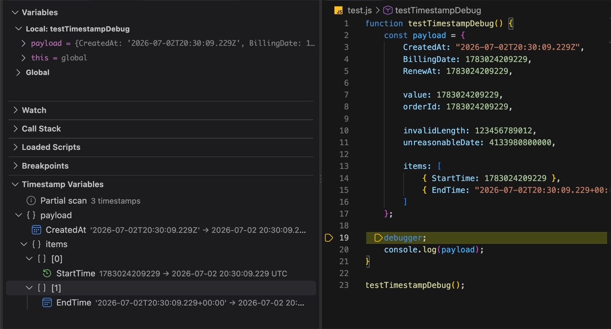

# Timestamp Debug

[](https://marketplace.visualstudio.com/items?itemName=qieps.timestamp-debug)

Timestamp Debug finds Unix and ISO timestamps in debugger variables and shows them as readable dates without changing the original values.

## Quick Start

1. [Install Timestamp Debug from the VS Code Marketplace](https://marketplace.visualstudio.com/items?itemName=qieps.timestamp-debug).
2. Start a debugging session and stop on a breakpoint.
3. Open `Run and Debug`.
4. Find the `Timestamp Variables` view.

For a debugger variable such as:

```text
Start = 1783024209229
```

the view displays:

```text
timeSegments
└─ [0]
   └─ Start  1783024209229 → 2026-07-02 20:30:09.229 UTC
```



## Features

- Automatically scans debugger variables when execution stops.
- Recursively follows nested debugger variables through standard DAP `variablesReference` values and configurable safety limits.
- Detects timestamp fields using built-in rules, exact custom names and regular expressions.
- Provides Safe and Aggressive detection modes; Safe is the default.
- Recognizes Unix timestamps in seconds, milliseconds, microseconds and nanoseconds.
- Recognizes strict ISO timestamp strings with `Z` or numeric UTC offsets.
- Supports UTC, local time and fixed UTC offsets with minute precision.
- Supports ISO-style and European date display formats.
- Groups timestamp variables into a collapsible tree matching their debugger paths.
- Uses theme-aware colored icons for groups, array indices, Unix values, ISO values and scan states.
- Supports date-only and timestamp-with-date display modes.
- Copies the timestamp, formatted date or variable path from the item context menu.
- Refreshes automatically after relevant settings change while the debugger is stopped.
- Clears results when debugging continues or the active debug session ends.
- Keeps the original debugger value unchanged.

## How Timestamp Detection Works

### Safe Mode

Safe mode is enabled by default. A value is checked only when its field name matches one of these rules, in this order:

1. Built-in timestamp field rules.
2. An exact name from `timestampDebug.customFields`.
3. A regular expression from `timestampDebug.fieldPatterns`.

Built-in rules recognize common names such as `Start`, `End`, `LastStart`, `StartTime`, `EndTime`, `CreatedAt`, `UpdatedAt`, `DeletedAt`, `ActivateAt`, `ExpiresAt`, `ExpiredAt`, `Timestamp` and `DateTime`.

Built-in matching is case-insensitive and ignores `_` and `-`. Custom field names are exact and case-sensitive. Regular expressions are checked only when the built-in and custom rules do not match.

### Aggressive Mode

Aggressive mode checks compatible Unix and ISO values regardless of their field names. This can find timestamps stored in generic fields such as `value`, but it may also interpret numeric identifiers such as `orderId` as timestamps.

Use Aggressive mode only when broader detection is more important than avoiding false positives.

### Value Validation

In both modes, the complete value must be either a supported Unix timestamp or a strict ISO timestamp. Embedded timestamps are not detected.

Unix values must:

- contain only an optional minus sign followed by digits;
- have exactly 10, 13, 16 or 19 digits;
- convert to a date between the years 2000 and 2100.

ISO values must contain a complete date, time and timezone. Supported forms are:

```text
2026-07-02T20:30:09Z
2026-07-02T20:30:09.229Z
2026-07-02T20:30:09+03:00
2026-07-02T20:30:09.229+03:00
2026-07-02 20:30:09.229+00:00
```

Invalid calendar dates, missing timezones, lowercase `z`, partial values and fractional seconds other than exactly three digits are rejected. Matching single or double quotes added by a debugger are supported and preserved as part of the raw value.

## Supported Unix Timestamp Units

| Digits | Unit |
| ---: | --- |
| 10 | Seconds |
| 13 | Milliseconds |
| 16 | Microseconds |
| 19 | Nanoseconds |

## How Debugger Traversal Works

Timestamp Debug scans variables automatically when execution stops; debugger variables do not need to be expanded manually first.

The traversal uses standard Debug Adapter Protocol requests:

1. `stackTrace` selects the top stack frame.
2. `scopes` discovers the variable scopes exposed by the debugger.
3. `variables` reads each scope and follows every positive `variablesReference` recursively.

Scopes are completed in the order supplied by the debug adapter. Independent root branches are scanned in round-robin order so a wide object, such as a global context, cannot prevent a deeper sibling object from being inspected. Traversal does not use Go, JavaScript, Python or other language-specific type strings to decide whether a variable has children.

Cycles are protected by visited DAP references and the configured depth, per-level and total-variable limits. Some debug adapters assign a new `variablesReference` to each path leading to the same object. In that case the view may contain multiple valid paths such as `data.CreatedAt` and `cycle.parent.CreatedAt`; the safety limits still guarantee that scanning terminates.

## Settings

| Setting | Default | Description |
| --- | --- | --- |
| `timestampDebug.timezone` | `utc` | Display timezone: `utc`, `local` or `fixed`. |
| `timestampDebug.fixedOffset` | `UTC+00:00` | Offset used when `timezone` is `fixed`. |
| `timestampDebug.dateFormat` | `iso` | Date format: `iso` or `european`. |
| `timestampDebug.displayMode` | `timestampAndDate` | Leaf display: `date` or `timestampAndDate`. |
| `timestampDebug.detectionMode` | `safe` | Detection mode: `safe` or `aggressive`. |
| `timestampDebug.customFields` | `[]` | Additional exact, case-sensitive field names. |
| `timestampDebug.fieldPatterns` | `[]` | JavaScript regular expressions for field names. |
| `timestampDebug.maxScanDepth` | `4` | Maximum recursive depth; top-level variables are at depth `0`. |
| `timestampDebug.maxVariablesPerLevel` | `100` | Maximum variables processed at one level. |
| `timestampDebug.maxTotalVariables` | `1000` | Maximum variables processed during one scan. |

Example `settings.json` configuration:

```json
{
  "timestampDebug.timezone": "fixed",
  "timestampDebug.fixedOffset": "UTC+05:45",
  "timestampDebug.dateFormat": "european",
  "timestampDebug.displayMode": "timestampAndDate",
  "timestampDebug.detectionMode": "safe",
  "timestampDebug.customFields": [
    "BillingDate",
    "RenewAt"
  ],
  "timestampDebug.fieldPatterns": [
    ".*Timestamp$"
  ],
  "timestampDebug.maxScanDepth": 4,
  "timestampDebug.maxVariablesPerLevel": 100,
  "timestampDebug.maxTotalVariables": 1000
}
```

### Custom Fields and Patterns

`timestampDebug.customFields` matches the complete field name exactly. For example, `BillingDate` does not match `billingdate` or `BillingDateValue`.

`timestampDebug.fieldPatterns` uses JavaScript regular-expression syntax. Do not include surrounding `/` characters. Use `^` and `$` when a pattern must match the complete field name. Invalid expressions are ignored without disabling other detection rules.

A matching name is displayed only when its value is also a valid supported Unix or ISO timestamp.

### Fixed UTC Offsets

Fixed offsets must use the exact `UTC±HH:MM` format and be between `UTC-14:00` and `UTC+14:00`.

Supported examples include:

```text
UTC+03:00
UTC-04:00
UTC+05:30
UTC+05:45
```

An invalid offset falls back to `UTC+00:00`. The offset affects only the displayed date.

### Date Formats

```text
ISO:
2026-07-02 20:30:09.229 UTC

European:
02.07.2026 20:30:09.229 UTC
```

All supported setting changes automatically refresh the view while the debugger is stopped.

## Timestamp Variables View

Use the refresh button in the view title to scan the current stopped frame again.

Timestamp paths are displayed as a collapsible hierarchy:

```text
timeSegments
├─ [0]
│  ├─ Start
│  └─ End
└─ [1]
   ├─ Start
   └─ End
```

Timestamp leaf nodes support two display modes:

```text
Date only:
Start  2026-07-02 20:30:09.229 UTC

Timestamp + Date:
Start  1783024209229 → 2026-07-02 20:30:09.229 UTC
```

Set `timestampDebug.displayMode` to `date` or `timestampAndDate`. Changes are applied immediately. The tooltip always includes the complete variable path, original raw value and formatted date.

Tree icons use semantic colors from the active VS Code theme:

- root groups use the namespace color;
- nested groups use the object color;
- bracketed indices use the array color;
- Unix timestamp leaves use a green clock;
- ISO timestamp leaves use a blue calendar.

The first row reports the current scan state: waiting for a paused debugger, scanning, completed, no timestamps found or failed. Completed scans also show the number of timestamp paths found.

`Partial scan` is an informational state, not an error. It means a configured safety limit stopped traversal before every debugger variable was visited. This is common for large global scopes. Hover over the status to see only the limits that were reached, their configured values, and confirmation that displayed timestamps remain valid.

Right-click a timestamp leaf to access:

- `Copy Timestamp` — copies only the original raw value.
- `Copy Formatted Date` — copies only the displayed date.
- `Copy Variable Path` — copies only the debugger variable path.

No labels or additional text are added to copied values. For ISO timestamps, Copy Timestamp preserves the raw debugger value.

Copy commands use the standard theme icons for raw values, formatted dates and variable paths. Group and status rows do not expose timestamp copy actions.

## Debugger Compatibility

Timestamp Debug uses language-independent Debug Adapter Protocol traversal and does not interpret language-specific type strings when following nested values. Automated DAP fixtures cover Go pointer and map shapes, JavaScript objects and arrays, and Python dictionaries.

Simple local-variable detection has been manually verified with Go through Delve. Recursive objects, arrays and cyclic references have been manually verified with the built-in JavaScript debugger. Live recursive validation with Go and Python debugger adapters is still recommended.

## Development

Install dependencies, compile the extension and run the tests:

```bash
npm ci
npm run compile
npm test
```

## Links

- [Visual Studio Marketplace](https://marketplace.visualstudio.com/items?itemName=qieps.timestamp-debug)
- [GitHub Repository](https://github.com/QIEPS/timestamp-debug)
- [Issues](https://github.com/QIEPS/timestamp-debug/issues)
